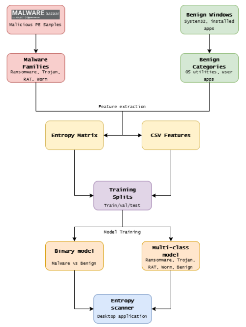
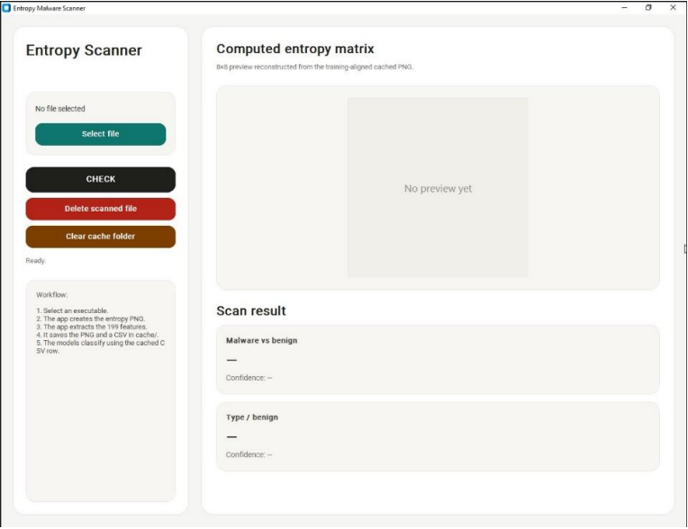
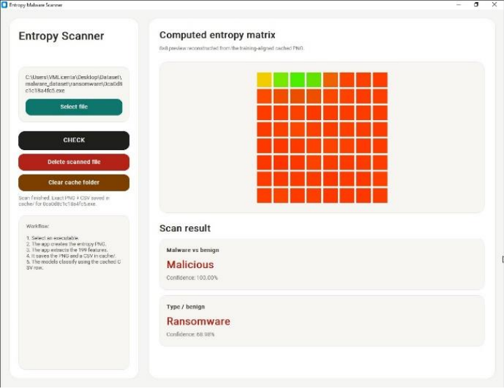
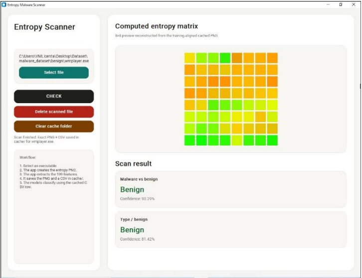

# Machine Learning Powered Antivirus with Image-Based Signatures

A lightweight antivirus-style project that analyzes Portable Executable (PE) files using static features, entropy-based visualization, and machine learning.  
The system can classify files as **malware** or **benign**, and also supports family-level classification.

## How It Works

1. The user selects a file.
2. The system reads the PE structure and extracts static information.
3. Entropy is calculated and converted into an RGB image-like signature.
4. Two Random Forest models analyze the features.
5. The app returns a double prediction with confidence (Malware vs. Benign / Family attribution).

## Main Features

- Static analysis of PE files.
- Entropy-based RGB image signatures.
- Random Forest classification.
- Binary and multi-class detection.
- Simple antivirus-style interface.

## Project Images

Add screenshots here to show the pipeline and the interface.

### Full workflow

### Main application

### Example scans

## Dataset

The project uses malware and benign PE samples, organized for training and evaluation.  
Features are extracted from the first part of each file and transformed into a 199-dimensional representation.

## Results

The thesis reports strong performance for both binary and multi-class classification, with the model also providing feature-importance insights.

## Requirements

- Python
- scikit-learn
- NumPy
- pandas
- matplotlib
- PE parsing / file analysis libraries

## Author

Vlad-Andrei Paraschiv
